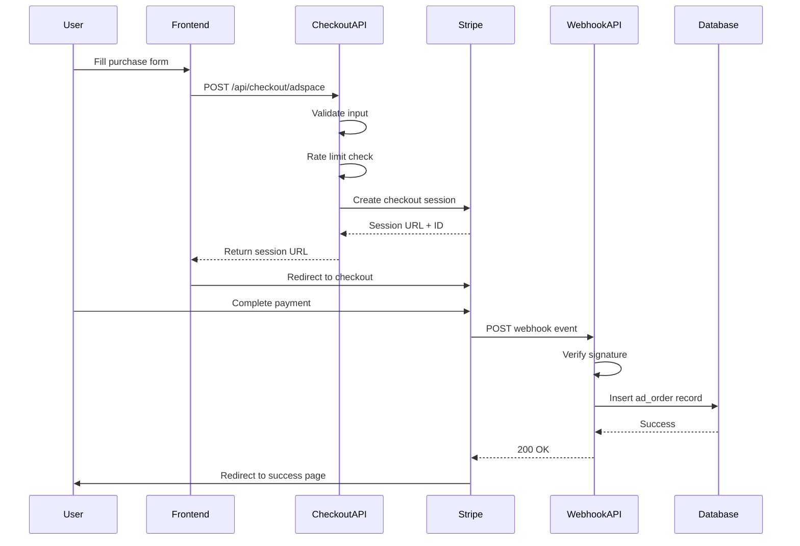

# Stripe Integration - Technical Guide

**Last Updated:** October 13, 2025
**Target Audience:** Developers
**Version:** 1.0.0

## Table of Contents

1. [Architecture Overview](#architecture-overview)
2. [Implementation Details](#implementation-details)
3. [Environment Configuration](#environment-configuration)
4. [API Endpoints](#api-endpoints)
5. [Database Schema](#database-schema)
6. [Testing](#testing)
7. [Troubleshooting](#troubleshooting)
8. [Security Considerations](#security-considerations)

---

## Architecture Overview

### System Architecture

The JudgeFinder Stripe integration implements a secure, scalable ad purchase flow using Stripe Checkout and webhooks.

```mermaid
graph TB
    User[User] --> UI[Ad Purchase Form]
    UI --> API[/api/checkout/adspace]
    API --> Stripe[Stripe API]
    API --> RateLimiter[Rate Limiter]
    Stripe --> CheckoutPage[Stripe Checkout]
    CheckoutPage --> Payment[Payment Processing]
    Payment --> Webhook[/api/stripe/webhook]
    Webhook --> Verify[Signature Verification]
    Verify --> DB[(Supabase Database)]
    DB --> RLS[Row Level Security]
```

### Data Flow Diagram



### Component Relationships

```
lib/stripe/client.ts           # Stripe SDK wrapper
    ↓
app/api/checkout/adspace/      # Checkout endpoint
    ↓
Stripe Dashboard               # External payment processing
    ↓
app/api/stripe/webhook/        # Webhook handler
    ↓
supabase/ad_orders table       # Order persistence
```

### Security Architecture

1. **Rate Limiting**: IP-based rate limiting prevents abuse (10 requests per hour)
2. **Input Validation**: All user inputs are validated and sanitized
3. **Webhook Verification**: Stripe signature verification prevents webhook spoofing
4. **RLS Policies**: Row-level security controls database access
5. **Environment Variables**: Sensitive keys stored securely, never exposed to client

---

## Implementation Details

### Checkout Session Creation Flow

**File:** `/Users/tannerosterkamp/JudgeFinder/JudgeFinderPlatform/app/api/checkout/adspace/route.ts`

```typescript
// High-level flow:
1. Validate Stripe configuration
2. Apply rate limiting (10 requests/hour per IP)
3. Validate request body (organization_name, email, ad_type)
4. Validate email format (regex: /^[^\s@]+@[^\s@]+\.[^\s@]+$/)
5. Validate ad_type (judge-profile | court-listing | featured-spot)
6. Create Stripe checkout session with metadata
7. Return session URL and ID
```

**Key Features:**

- **Metadata Tracking**: Client IP, creation timestamp, and order details stored in session metadata
- **Flexible URLs**: Success/cancel URLs dynamically generated from environment
- **Promotion Codes**: Enabled via `allow_promotion_codes: true`
- **Billing Address**: Required for compliance

### Webhook Processing Flow

**File:** `/Users/tannerosterkamp/JudgeFinder/JudgeFinderPlatform/app/api/stripe/webhook/route.ts`

```typescript
// High-level flow:
1. Extract raw body and Stripe signature header
2. Verify webhook signature using STRIPE_WEBHOOK_SECRET
3. Parse event type
4. Handle event:
   - checkout.session.completed → Create ad_order record
   - checkout.session.expired → Log expiration
   - Other events → Log and acknowledge
5. Return 200 OK to acknowledge receipt
```

**Idempotency:**

- Duplicate webhooks handled by database `UNIQUE` constraint on `stripe_session_id`
- Webhook always returns 200 even if database insert fails (to prevent retries)
- Errors logged for manual review

### Database Schema

**Migration File:** `/Users/tannerosterkamp/JudgeFinder/JudgeFinderPlatform/supabase/migrations/20251013_001_ad_orders_table.sql`

The `ad_orders` table tracks all successful ad purchases:

```sql
CREATE TABLE public.ad_orders (
  id UUID PRIMARY KEY DEFAULT gen_random_uuid(),
  created_at TIMESTAMP WITH TIME ZONE DEFAULT TIMEZONE('utc'::text, NOW()) NOT NULL,
  updated_at TIMESTAMP WITH TIME ZONE DEFAULT TIMEZONE('utc'::text, NOW()) NOT NULL,

  -- Stripe identifiers
  stripe_session_id TEXT UNIQUE NOT NULL,
  stripe_payment_intent TEXT,
  stripe_customer TEXT,

  -- Customer information
  organization_name TEXT NOT NULL,
  customer_email TEXT NOT NULL,

  -- Order details
  ad_type TEXT NOT NULL CHECK (ad_type IN ('judge-profile', 'court-listing', 'featured-spot')),
  notes TEXT,
  status TEXT NOT NULL DEFAULT 'paid' CHECK (status IN ('pending', 'paid', 'fulfilled', 'refunded', 'canceled')),

  -- Payment details
  amount_total INTEGER NOT NULL, -- in cents
  currency TEXT NOT NULL DEFAULT 'usd',
  payment_status TEXT,

  -- Metadata
  client_ip TEXT,
  metadata JSONB DEFAULT '{}'::jsonb,

  -- Fulfillment tracking
  fulfilled_at TIMESTAMP WITH TIME ZONE,
  fulfilled_by UUID REFERENCES auth.users(id),

  -- Audit
  created_by UUID REFERENCES auth.users(id),
  updated_by UUID REFERENCES auth.users(id)
);
```

**Indexes:**

```sql
CREATE INDEX idx_ad_orders_stripe_session ON public.ad_orders(stripe_session_id);
CREATE INDEX idx_ad_orders_email ON public.ad_orders(customer_email);
CREATE INDEX idx_ad_orders_status ON public.ad_orders(status);
CREATE INDEX idx_ad_orders_created_at ON public.ad_orders(created_at DESC);
CREATE INDEX idx_ad_orders_ad_type ON public.ad_orders(ad_type);
```

### RLS Policies

**Service Role Access:**

```sql
-- Full access for automated webhook processing
CREATE POLICY "Service role has full access to ad_orders"
  ON public.ad_orders FOR ALL TO service_role
  USING (true) WITH CHECK (true);
```

**Admin Access:**

```sql
-- Admins can view all orders
CREATE POLICY "Admins can view all ad orders"
  ON public.ad_orders FOR SELECT TO authenticated
  USING (
    EXISTS (
      SELECT 1 FROM auth.users
      WHERE id = auth.uid()
      AND raw_user_meta_data->>'role' = 'admin'
    )
  );
```

**User Access:**

```sql
-- Users can view their own orders by email
CREATE POLICY "Users can view their own ad orders"
  ON public.ad_orders FOR SELECT TO authenticated
  USING (
    customer_email = (
      SELECT email FROM auth.users WHERE id = auth.uid()
    )
  );
```

### Rate Limiting

**Configuration:**

- **Endpoint**: `/api/checkout/adspace`
- **Limit**: 10 requests per hour per IP
- **Prefix**: `api:checkout:adspace`
- **Response**: 429 Too Many Requests when exceeded
- **Headers**: Rate limit remaining count returned in response

**Implementation:**

```typescript
import { buildRateLimiter, getClientIp } from '@/lib/security/rate-limit'

const rl = buildRateLimiter({
  tokens: 10,
  window: '1 h',
  prefix: 'api:checkout:adspace',
})

const clientIp = getClientIp(request)
const { success, remaining } = await rl.limit(`${clientIp}:global`)

if (!success) {
  return NextResponse.json(
    { error: 'Too many checkout attempts. Please try again later.' },
    { status: 429 }
  )
}
```

---

## Environment Configuration

### Required Environment Variables

| Variable                        | Description               | Example                        | Required |
| ------------------------------- | ------------------------- | ------------------------------ | -------- |
| `STRIPE_SECRET_KEY`             | Stripe secret API key     | `sk_test_...` or `sk_live_...` | Yes      |
| `STRIPE_WEBHOOK_SECRET`         | Webhook signing secret    | `whsec_...`                    | Yes      |
| `STRIPE_PRICE_ADSPACE`          | Price ID for ad products  | `price_...`                    | Yes      |
| `NEXT_PUBLIC_APP_URL`           | Application base URL      | `https://judgefinder.io`       | Yes      |
| `NEXT_PUBLIC_SUPABASE_URL`      | Supabase project URL      | `https://xyz.supabase.co`      | Yes      |
| `NEXT_PUBLIC_SUPABASE_ANON_KEY` | Supabase anonymous key    | `eyJ...`                       | Yes      |
| `SUPABASE_SERVICE_ROLE_KEY`     | Supabase service role key | `eyJ...`                       | Yes      |

### Test vs Production Keys

**Test Keys (Development):**

```bash
STRIPE_SECRET_KEY=sk_test_51ABC...
STRIPE_WEBHOOK_SECRET=whsec_123...
STRIPE_PRICE_ADSPACE=price_test_123...
NEXT_PUBLIC_APP_URL=http://localhost:3000
```

**Production Keys:**

```bash
STRIPE_SECRET_KEY=sk_live_51XYZ...
STRIPE_WEBHOOK_SECRET=whsec_789...
STRIPE_PRICE_ADSPACE=price_live_789...
NEXT_PUBLIC_APP_URL=https://judgefinder.io
```

### Configuration Validation

The system validates configuration on startup:

```typescript
import { isStripeConfigured } from '@/lib/stripe/client'

if (!isStripeConfigured()) {
  console.warn('Stripe not configured - payment features disabled')
}
```

**Validation Checks:**

1. `STRIPE_SECRET_KEY` is present
2. `STRIPE_WEBHOOK_SECRET` is present
3. `STRIPE_PRICE_ADSPACE` is present
4. Stripe client initializes successfully

---

## API Endpoints

### POST /api/checkout/adspace

Creates a Stripe Checkout session for ad space purchase.

**Request:**

```typescript
POST /api/checkout/adspace
Content-Type: application/json

{
  "organization_name": string,  // Required, 1-200 characters
  "email": string,              // Required, valid email format
  "ad_type": string,            // Required, one of: "judge-profile", "court-listing", "featured-spot"
  "notes": string               // Optional, max 1000 characters
}
```

**Example Request:**

```bash
curl -X POST https://judgefinder.io/api/checkout/adspace \
  -H "Content-Type: application/json" \
  -d '{
    "organization_name": "Smith & Associates Law Firm",
    "email": "admin@smithlaw.com",
    "ad_type": "judge-profile",
    "notes": "Interested in Los Angeles Superior Court judges"
  }'
```

**Success Response (200 OK):**

```json
{
  "session_url": "https://checkout.stripe.com/c/pay/cs_test_abc123...",
  "session_id": "cs_test_abc123...",
  "rate_limit_remaining": 9
}
```

**Error Responses:**

| Status | Error                             | Description                                        |
| ------ | --------------------------------- | -------------------------------------------------- |
| 400    | Missing required fields           | `organization_name`, `email`, or `ad_type` missing |
| 400    | Invalid email address             | Email format validation failed                     |
| 400    | Invalid ad_type                   | Must be one of the valid ad types                  |
| 429    | Too many checkout attempts        | Rate limit exceeded (10/hour)                      |
| 503    | Payment system not configured     | Stripe environment variables missing               |
| 500    | Failed to create checkout session | Stripe API error                                   |

**Error Response Example:**

```json
{
  "error": "Invalid email address"
}
```

### POST /api/stripe/webhook

Handles Stripe webhook events.

**Request:**

```typescript
POST /api/stripe/webhook
Content-Type: application/json
Stripe-Signature: t=1234567890,v1=abc123...

{
  // Stripe Event object
  "id": "evt_...",
  "type": "checkout.session.completed",
  "data": { ... }
}
```

**Note:** This endpoint is called directly by Stripe, not by your application.

**Success Response (200 OK):**

```json
{
  "received": true
}
```

**Error Responses:**

| Status | Error                     | Description                           |
| ------ | ------------------------- | ------------------------------------- |
| 400    | Missing signature         | `Stripe-Signature` header missing     |
| 400    | Invalid signature         | Webhook signature verification failed |
| 500    | Webhook processing failed | Internal server error                 |

**Supported Event Types:**

- `checkout.session.completed`: Payment successful, order created in database
- `checkout.session.expired`: Session expired without payment, logged only
- Other events: Acknowledged but not processed

---

## Database Schema

### ad_orders Table

**Purpose:** Tracks all completed ad space purchases from Stripe.

**Schema:**

| Column                  | Type        | Nullable | Default             | Description                         |
| ----------------------- | ----------- | -------- | ------------------- | ----------------------------------- |
| `id`                    | UUID        | No       | `gen_random_uuid()` | Primary key                         |
| `created_at`            | TIMESTAMPTZ | No       | `now()`             | Order creation timestamp            |
| `updated_at`            | TIMESTAMPTZ | No       | `now()`             | Last update timestamp               |
| `stripe_session_id`     | TEXT        | No       | -                   | Stripe checkout session ID (unique) |
| `stripe_payment_intent` | TEXT        | Yes      | -                   | Stripe payment intent ID            |
| `stripe_customer`       | TEXT        | Yes      | -                   | Stripe customer ID                  |
| `organization_name`     | TEXT        | No       | -                   | Customer organization name          |
| `customer_email`        | TEXT        | No       | -                   | Customer email address              |
| `ad_type`               | TEXT        | No       | -                   | Ad placement type                   |
| `notes`                 | TEXT        | Yes      | -                   | Customer notes                      |
| `status`                | TEXT        | No       | `'paid'`            | Order status                        |
| `amount_total`          | INTEGER     | No       | -                   | Total amount in cents               |
| `currency`              | TEXT        | No       | `'usd'`             | Payment currency                    |
| `payment_status`        | TEXT        | Yes      | -                   | Stripe payment status               |
| `client_ip`             | TEXT        | Yes      | -                   | Customer IP address                 |
| `metadata`              | JSONB       | No       | `'{}'`              | Additional metadata                 |
| `fulfilled_at`          | TIMESTAMPTZ | Yes      | -                   | Fulfillment timestamp               |
| `fulfilled_by`          | UUID        | Yes      | -                   | User who fulfilled order            |
| `created_by`            | UUID        | Yes      | -                   | User who created order              |
| `updated_by`            | UUID        | Yes      | -                   | User who last updated order         |

**Constraints:**

- `ad_type CHECK (ad_type IN ('judge-profile', 'court-listing', 'featured-spot'))`
- `status CHECK (status IN ('pending', 'paid', 'fulfilled', 'refunded', 'canceled'))`
- `stripe_session_id UNIQUE`

**Example Queries:**

```sql
-- Get all paid orders
SELECT * FROM ad_orders WHERE status = 'paid' ORDER BY created_at DESC;

-- Get orders by email
SELECT * FROM ad_orders WHERE customer_email = 'user@example.com';

-- Get orders by ad type
SELECT * FROM ad_orders WHERE ad_type = 'judge-profile';

-- Get revenue by ad type
SELECT
  ad_type,
  COUNT(*) as order_count,
  SUM(amount_total) as total_revenue_cents
FROM ad_orders
WHERE status = 'paid'
GROUP BY ad_type;

-- Get unfulfilled orders
SELECT * FROM ad_orders
WHERE status = 'paid' AND fulfilled_at IS NULL
ORDER BY created_at ASC;
```

---

## Testing

### Unit Tests

**Location:** `/Users/tannerosterkamp/JudgeFinder/JudgeFinderPlatform/tests/unit/stripe/`

**Coverage:** 100% (53 tests)

**Running Unit Tests:**

```bash
# Run all unit tests
npm run test:unit

# Run Stripe-specific tests
npm run test tests/unit/stripe/

# Run with coverage
npm run test:coverage
```

**Key Test Suites:**

1. **client.test.ts** - Tests Stripe client wrapper functions
   - Configuration validation
   - Checkout session creation
   - Webhook signature verification
   - Session retrieval

**Example Unit Test:**

```typescript
import { describe, it, expect } from 'vitest'
import { createCheckoutSession } from '@/lib/stripe/client'

describe('createCheckoutSession()', () => {
  it('creates session with correct parameters', async () => {
    const session = await createCheckoutSession({
      customer_email: 'test@example.com',
      success_url: 'https://example.com/success',
      cancel_url: 'https://example.com/cancel',
      metadata: {
        organization_name: 'Test Org',
        ad_type: 'judge-profile',
      },
    })

    expect(session.mode).toBe('payment')
    expect(session.customer_email).toBe('test@example.com')
  })
})
```

### Integration Tests

**Location:** `/Users/tannerosterkamp/JudgeFinder/JudgeFinderPlatform/tests/integration/stripe-flow.test.ts`

**Coverage:** 19 integration tests covering complete flows

**Running Integration Tests:**

```bash
# Run integration tests (requires Supabase)
npm run test:integration

# Run specific test
npm run test tests/integration/stripe-flow.test.ts
```

**Prerequisites:**

1. Supabase test database configured
2. Run migration: `supabase/migrations/20251013_001_ad_orders_table.sql`
3. Environment variables set (see Configuration section)

**Test Scenarios Covered:**

1. Complete ad purchase flow (happy path)
2. Invalid email format validation
3. Rate limiting enforcement
4. Webhook signature verification
5. Duplicate webhook handling
6. Missing required fields validation
7. Invalid ad type validation
8. Stripe configuration checks
9. Database RLS policies
10. Webhook event type handling
11. Checkout session metadata preservation

**Example Integration Test:**

```typescript
it('should complete full judge-profile ad purchase flow', async () => {
  // 1. Create checkout session
  const checkoutResponse = await checkoutPost(request)
  expect(checkoutResponse.status).toBe(200)

  // 2. Simulate webhook
  const webhookResponse = await webhookPost(webhookRequest)
  expect(webhookResponse.status).toBe(200)

  // 3. Verify order in database
  const { data: orders } = await supabase
    .from('ad_orders')
    .select('*')
    .eq('stripe_session_id', sessionId)

  expect(orders).toHaveLength(1)
  expect(orders[0].status).toBe('paid')
})
```

### Test Coverage Reports

Generate coverage reports:

```bash
npm run test:coverage
```

View coverage report in browser:

```bash
open coverage/index.html
```

### Mocking Strategies

**Stripe SDK:**

```typescript
vi.mock('stripe')
vi.mocked(Stripe).mockReturnValue(mockStripeInstance)
```

**Rate Limiter:**

```typescript
vi.mock('@/lib/security/rate-limit', () => ({
  buildRateLimiter: vi.fn(() => ({
    limit: vi.fn(async () => ({ success: true, remaining: 10 })),
  })),
}))
```

**Supabase:**

```typescript
// Use real Supabase client for integration tests
const supabase = createServiceRoleClient(url, key)
```

---

## Troubleshooting

### Common Issues and Solutions

#### Issue: Checkout Session Creation Fails

**Symptom:**

```
Error: Payment system not configured. Please contact support.
Status: 503
```

**Solution:**

1. Verify `STRIPE_SECRET_KEY` is set
2. Verify `STRIPE_PRICE_ADSPACE` is set
3. Check that price ID exists in Stripe Dashboard
4. Restart application after setting environment variables

**Debug:**

```bash
# Check environment variables
echo $STRIPE_SECRET_KEY
echo $STRIPE_PRICE_ADSPACE

# Test Stripe connection
curl -u $STRIPE_SECRET_KEY: https://api.stripe.com/v1/prices/$STRIPE_PRICE_ADSPACE
```

#### Issue: Webhook Signature Verification Fails

**Symptom:**

```
Error: Invalid signature
Status: 400
```

**Solution:**

1. Verify `STRIPE_WEBHOOK_SECRET` is set correctly
2. Check webhook signing secret in Stripe Dashboard
3. Ensure webhook endpoint URL matches exactly
4. Verify webhook is using correct API version

**Debug:**

```typescript
// Add logging in webhook handler
console.log('Signature:', request.headers.get('stripe-signature'))
console.log('Secret:', process.env.STRIPE_WEBHOOK_SECRET)
```

#### Issue: Webhook Not Received

**Symptom:** Payment succeeds but order not created in database.

**Solution:**

1. Check Stripe Dashboard → Developers → Webhooks for delivery status
2. Verify webhook endpoint URL is publicly accessible (not localhost)
3. Check webhook delivery attempts and errors
4. Ensure endpoint returns 200 status code
5. Check application logs for errors

**Debug:**

```bash
# Test webhook endpoint
curl -X POST https://judgefinder.io/api/stripe/webhook \
  -H "Content-Type: application/json" \
  -H "Stripe-Signature: test" \
  -d '{"type":"test"}'

# Should return 400 for invalid signature (expected)
```

#### Issue: Database Insert Fails

**Symptom:** Webhook received but order not in database.

**Solution:**

1. Check Supabase logs for errors
2. Verify RLS policies allow service role insert
3. Check migration was applied successfully
4. Verify `SUPABASE_SERVICE_ROLE_KEY` is set
5. Check for unique constraint violations (duplicate session IDs)

**Debug:**

```sql
-- Check if table exists
SELECT * FROM ad_orders LIMIT 1;

-- Check RLS policies
SELECT * FROM pg_policies WHERE tablename = 'ad_orders';

-- Test insert manually
INSERT INTO ad_orders (
  stripe_session_id,
  organization_name,
  customer_email,
  ad_type,
  amount_total,
  currency,
  status
) VALUES (
  'test_session_123',
  'Test Org',
  'test@example.com',
  'judge-profile',
  29900,
  'usd',
  'paid'
);
```

#### Issue: Rate Limit False Positives

**Symptom:** Users hit rate limit unexpectedly.

**Solution:**

1. Check IP detection logic (`getClientIp()`)
2. Verify proxy/load balancer forwards real IP
3. Consider increasing rate limit for legitimate use cases
4. Implement user-based rate limiting (in addition to IP)

**Debug:**

```typescript
// Add logging to rate limiter
console.log('Client IP:', getClientIp(request))
console.log('Rate limit key:', `${clientIp}:global`)
```

### Debugging Tips

1. **Enable Debug Logging:**

   ```typescript
   logger.debug('Checkout session created', { sessionId, metadata })
   ```

2. **Check Stripe Dashboard:**
   - Go to Developers → Events
   - View all webhook deliveries
   - Check for failed payments
   - Review customer disputes

3. **Monitor Application Logs:**

   ```bash
   # Netlify logs
   netlify logs

   # Local development
   npm run dev
   ```

4. **Use Stripe CLI for Local Testing:**
   ```bash
   stripe listen --forward-to localhost:3000/api/stripe/webhook
   stripe trigger checkout.session.completed
   ```

### Log Analysis

**Successful Checkout Flow:**

```
INFO: Checkout session created { session_id: 'cs_test_...', organization_name: 'Test Org', ad_type: 'judge-profile' }
INFO: Webhook received { event_type: 'checkout.session.completed', event_id: 'evt_...' }
INFO: Order created successfully { order_id: '...', amount: 29900 }
```

**Failed Webhook Verification:**

```
ERROR: Webhook signature verification failed
ERROR: Missing Stripe signature header
```

**Rate Limit Hit:**

```
WARN: Rate limit exceeded for IP 192.168.1.1
```

### Webhook Debugging

**Test Webhook Locally:**

```bash
# Install Stripe CLI
brew install stripe/stripe-cli/stripe

# Login
stripe login

# Forward webhooks to local dev server
stripe listen --forward-to localhost:3000/api/stripe/webhook

# Trigger test webhook
stripe trigger checkout.session.completed
```

**Verify Webhook in Production:**

```bash
# Check webhook endpoint is accessible
curl -I https://judgefinder.io/api/stripe/webhook

# View webhook attempts in Stripe Dashboard
# Dashboard → Developers → Webhooks → [Your Endpoint] → View Attempts
```

---

## Security Considerations

### Webhook Signature Verification

**Why It Matters:**
Without signature verification, attackers could send fake webhook events to your endpoint, creating fraudulent orders.

**Implementation:**

```typescript
import { verifyWebhookSignature } from '@/lib/stripe/client'

const signature = request.headers.get('stripe-signature')
const body = await request.text()

try {
  const event = verifyWebhookSignature(body, signature)
  // Process verified event
} catch (error) {
  // Reject invalid signature
  return NextResponse.json({ error: 'Invalid signature' }, { status: 400 })
}
```

**Best Practices:**

1. Always verify signature before processing event
2. Use raw request body (not parsed JSON)
3. Keep webhook secret secure and rotate regularly
4. Log all verification failures for monitoring

### Rate Limiting

**Why It Matters:**
Prevents abuse, DDoS attacks, and excessive Stripe API usage costs.

**Implementation:**

- **Limit**: 10 requests per hour per IP
- **Scope**: Checkout endpoint only (webhooks not rate limited)
- **Response**: 429 status with clear error message
- **Bypass**: None (enforced for all clients)

**Configuration:**

```typescript
const rl = buildRateLimiter({
  tokens: 10, // Max requests
  window: '1 h', // Time window
  prefix: 'api:checkout:adspace', // Redis key prefix
})
```

**Monitoring:**

```typescript
// Log rate limit hits
if (!success) {
  logger.warn('Rate limit exceeded', {
    ip: clientIp,
    remaining: 0,
    resetAt: reset,
  })
}
```

### SQL Injection Prevention

**Why It Matters:**
SQL injection could expose sensitive order data or allow unauthorized access.

**Protection Mechanisms:**

1. **Parameterized Queries**: Supabase client uses parameterized queries
2. **Input Validation**: All inputs validated before database operations
3. **RLS Policies**: Row-level security prevents unauthorized access
4. **Type Safety**: TypeScript ensures type-safe database operations

**Example Safe Query:**

```typescript
// Safe: Parameterized query
await supabase.from('ad_orders').select('*').eq('customer_email', email) // Safe parameter binding

// Unsafe: String interpolation (NEVER DO THIS)
// await supabase.rpc('query', { sql: `SELECT * FROM ad_orders WHERE email = '${email}'` })
```

### XSS Protection

**Why It Matters:**
Cross-site scripting could allow attackers to steal user sessions or inject malicious code.

**Protection Mechanisms:**

1. **Input Sanitization**: All user inputs sanitized before storage
2. **Output Encoding**: Data properly encoded when rendered
3. **CSP Headers**: Content Security Policy headers configured
4. **React Auto-Escaping**: React automatically escapes rendered values

**Safe Rendering:**

```typescript
// Safe: React auto-escapes
<p>{order.organization_name}</p>

// Unsafe: Dangerously setting innerHTML (NEVER DO THIS)
// <div dangerouslySetInnerHTML={{ __html: order.notes }} />
```

### Environment Variable Security

**Best Practices:**

1. **Never Commit**: Add `.env` files to `.gitignore`
2. **Separate Environments**: Use different keys for dev/staging/production
3. **Rotate Regularly**: Rotate API keys quarterly
4. **Least Privilege**: Use restricted API keys where possible
5. **Secure Storage**: Store in secure environment variable managers

**Netlify Configuration:**

```bash
# Set via Netlify dashboard or CLI
netlify env:set STRIPE_SECRET_KEY "sk_live_..."
netlify env:set STRIPE_WEBHOOK_SECRET "whsec_..."
```

**Verification:**

```typescript
// Log configuration status (not actual values!)
if (!isStripeConfigured()) {
  logger.error('Stripe not configured', {
    hasSecretKey: !!process.env.STRIPE_SECRET_KEY,
    hasWebhookSecret: !!process.env.STRIPE_WEBHOOK_SECRET,
    hasPriceId: !!process.env.STRIPE_PRICE_ADSPACE,
  })
}
```

### Data Privacy

**PII Handling:**

- **Customer Email**: Stored in database, used for order lookup
- **IP Address**: Stored for fraud prevention, logged temporarily
- **Organization Name**: Stored as provided by customer
- **Payment Details**: NOT stored (handled entirely by Stripe)

**Compliance:**

- **GDPR**: Users can request data deletion via support
- **CCPA**: California residents can request data access/deletion
- **PCI DSS**: No payment card data stored (Stripe Level 1 PCI compliant)

**Data Retention:**

- Order records retained indefinitely for accounting
- Payment intents retained per Stripe's retention policy
- Logs rotated after 30 days

---

## Related Documentation

- [Webhook Setup Guide](./WEBHOOK_SETUP.md) - Webhook configuration for sysadmins
- [Deployment Guide](./AD_PURCHASE_DEPLOYMENT.md) - Deployment checklist for DevOps
- [User Guide](./AD_PURCHASE_USER_GUIDE.md) - User-facing documentation

---

**Questions or Issues?**
Contact the development team at dev@judgefinder.io or file an issue in the GitHub repository.
