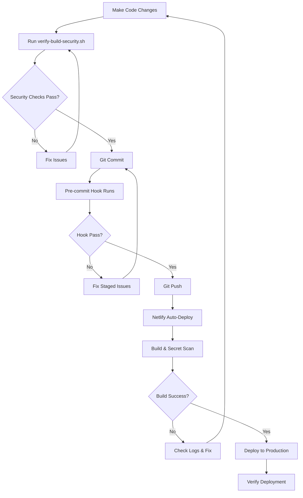
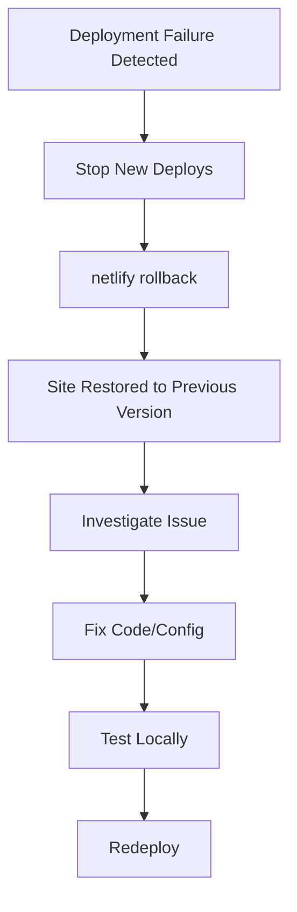

# Netlify Configuration Summary

This document provides an overview of all Netlify security and deployment configurations created for the JudgeFinder Platform.

## Created Files

### Configuration Files

#### 1. `.netlifyignore` (Enhanced)

**Location**: `JudgeFinderPlatform/.netlifyignore`

**Purpose**: Prevents sensitive files and build artifacts from being uploaded to Netlify during deployment.

**Key Sections**:

- Environment variables & secrets (`.env*`, API keys, credentials)
- Documentation with potential secrets
- Backup & data files
- Development & test files
- IDE configurations
- Build artifacts & cache
- Logs and temporary files

**Critical Patterns**:

```
.env
.env.*
*.key
*.pem
secrets.txt
credentials.json
NETLIFY_ENV_VARIABLES.txt
```

#### 2. `netlify.toml` (Enhanced)

**Location**: `JudgeFinderPlatform/netlify.toml`

**Enhancements**:

- Comprehensive `SECRETS_SCAN_OMIT_PATHS` configuration
- Detailed `SECRETS_SCAN_OMIT_KEYS` with rationale for each public key
- Documentation explaining why each path/key is excluded

**Secret Scanner Configuration**:

```toml
# Paths excluded from scanning (build artifacts, caches, etc.)
SECRETS_SCAN_OMIT_PATHS = ".netlify/**,.next/**,node_modules/**,..."

# Public keys safe to expose (NEXT_PUBLIC_* variables)
SECRETS_SCAN_OMIT_KEYS = "NEXT_PUBLIC_CLERK_PUBLISHABLE_KEY,..."
```

### Scripts

#### 3. `scripts/netlify-env-update.sh`

**Purpose**: Interactive script to set all required Netlify environment variables

**Features**:

- Guided setup for each environment variable
- Instructions on where to get each value
- Automatic validation of Netlify CLI installation
- Support for optional vs. required variables
- Secure password input (values not echoed)

**Usage**:

```bash
chmod +x scripts/netlify-env-update.sh
./scripts/netlify-env-update.sh
```

**Variables Configured**:

- Database (Supabase): 4 variables
- Authentication (Clerk): 2 variables
- AI Services (OpenAI, Google): 2 variables
- External APIs (CourtListener): 1 variable
- Cache & Rate Limiting (Upstash): 2 variables
- Payments (Stripe): 3 variables
- Monitoring (Sentry): 3 variables
- Security Keys: 3 variables
- Admin: 1 variable
- Analytics (optional): 2 variables
- SEO (optional): 2 variables

#### 4. `scripts/verify-build-security.sh`

**Purpose**: Comprehensive pre-deployment security verification

**Checks Performed**:

1. No `.env` files committed to git
2. No secrets in codebase (pattern scanning)
3. Required environment variables present
4. `.gitignore` and `.netlifyignore` properly configured
5. Build completes successfully (optional)
6. No secrets in build artifacts
7. Netlify configuration valid
8. No secrets in staged files

**Usage**:

```bash
chmod +x scripts/verify-build-security.sh
./scripts/verify-build-security.sh
```

**Exit Codes**:

- `0`: All checks passed
- `1`: Errors found, deployment should not proceed

#### 5. `scripts/pre-commit-security-check.sh`

**Purpose**: Git pre-commit hook to prevent committing secrets

**Features**:

- Prevents committing `.env` files
- Scans staged files for secret patterns
- Prevents committing sensitive file types
- Verifies `.gitignore` configuration
- Can be bypassed with `--no-verify` (not recommended)

**Installation**:

```bash
chmod +x scripts/pre-commit-security-check.sh
cp scripts/pre-commit-security-check.sh .git/hooks/pre-commit
```

Or with Husky:

```bash
# Add to .husky/pre-commit
./scripts/pre-commit-security-check.sh
```

### Documentation

#### 6. `docs/NETLIFY_SECURITY_GUIDE.md`

**Purpose**: Comprehensive security configuration guide

**Contents**:

- Secret scanner configuration explained
- Environment variables setup (3 methods)
- Deployment best practices
- Troubleshooting common issues
- Security checklist
- Key rotation procedures

**Sections**:

1. Overview & Security Principles
2. Secret Scanner Configuration (OMIT_PATHS, OMIT_KEYS)
3. Environment Variables Setup
4. Deployment Best Practices
5. Troubleshooting (10+ common issues)
6. Security Checklist
7. Key Rotation Process

#### 7. `docs/NETLIFY_TROUBLESHOOTING.md`

**Purpose**: Quick reference for common deployment issues

**Contents**:

- Common error messages with solutions
- Environment variable debugging
- Build performance issues
- Network issues
- Secret scanner deep dive
- Emergency procedures

**Covered Issues**:

1. Secret detected in build
2. Module not found
3. Environment variable undefined
4. Function timeout
5. Build script errors
6. File not found errors
7. Authentication failures
8. .netlifyignore not working
9. Rate limit exceeded
10. And more...

#### 8. `docs/NETLIFY_DEPLOYMENT_README.md`

**Purpose**: Complete deployment guide from scratch to production

**Contents**:

- Prerequisites checklist
- Initial setup (Netlify account, CLI, site creation)
- Configuration files overview
- Environment variables (complete list with categories)
- Deployment process (first and subsequent)
- Post-deployment verification
- Maintenance schedule
- Security best practices

**Key Sections**:

- Initial Setup (3 detailed steps)
- Environment Variables (categorized by priority)
- Deployment Process (production, preview, branch contexts)
- Verification Checklist
- Maintenance Tasks (daily, weekly, monthly)
- Scripts Reference
- Quick Reference Commands

#### 9. `NETLIFY_QUICK_START.md`

**Purpose**: Get deployed in under 30 minutes

**Contents**:

- 5-step deployment process
- Prerequisites checklist
- Common issues quick fixes
- Next steps after deployment

**Timeline**:

- Step 1: Install Netlify CLI (2 min)
- Step 2: Link Repository (3 min)
- Step 3: Set Environment Variables (15 min)
- Step 4: Verify Configuration (5 min)
- Step 5: Deploy (5 min)

#### 10. `NETLIFY_CONFIGURATION_SUMMARY.md`

**Purpose**: This document - overview of all configurations

---

## Environment Variables Reference

### Critical (Required for App to Start)

| Variable                            | Service       | Purpose                     |
| ----------------------------------- | ------------- | --------------------------- |
| `NEXT_PUBLIC_SUPABASE_URL`          | Supabase      | Database connection URL     |
| `NEXT_PUBLIC_SUPABASE_ANON_KEY`     | Supabase      | Public anonymous key        |
| `SUPABASE_SERVICE_ROLE_KEY`         | Supabase      | Server-side database access |
| `SUPABASE_JWT_SECRET`               | Supabase      | JWT signing secret          |
| `NEXT_PUBLIC_CLERK_PUBLISHABLE_KEY` | Clerk         | Public auth key             |
| `CLERK_SECRET_KEY`                  | Clerk         | Server-side auth            |
| `COURTLISTENER_API_KEY`             | CourtListener | Judicial data API           |
| `UPSTASH_REDIS_REST_URL`            | Upstash       | Cache/rate limiting         |
| `UPSTASH_REDIS_REST_TOKEN`          | Upstash       | Redis authentication        |
| `SYNC_API_KEY`                      | Internal      | Sync operation auth         |
| `CRON_SECRET`                       | Internal      | Scheduled function auth     |
| `ENCRYPTION_KEY`                    | Internal      | Data encryption             |
| `ADMIN_USER_IDS`                    | Clerk         | Admin access control        |

### Recommended (Full Functionality)

| Variable                             | Service | Purpose                 |
| ------------------------------------ | ------- | ----------------------- |
| `OPENAI_API_KEY`                     | OpenAI  | AI analytics (fallback) |
| `GOOGLE_AI_API_KEY`                  | Google  | AI analytics (primary)  |
| `STRIPE_SECRET_KEY`                  | Stripe  | Payment processing      |
| `NEXT_PUBLIC_STRIPE_PUBLISHABLE_KEY` | Stripe  | Client-side checkout    |
| `SENTRY_DSN`                         | Sentry  | Error tracking          |
| `NEXT_PUBLIC_SENTRY_DSN`             | Sentry  | Client error tracking   |

### Optional (Enhanced Features)

| Variable                               | Service          | Purpose            |
| -------------------------------------- | ---------------- | ------------------ |
| `NEXT_PUBLIC_GA_MEASUREMENT_ID`        | Google Analytics | Analytics          |
| `NEXT_PUBLIC_POSTHOG_KEY`              | PostHog          | Product analytics  |
| `NEXT_PUBLIC_GOOGLE_SITE_VERIFICATION` | Google           | SEO verification   |
| `NEXT_PUBLIC_BING_SITE_VERIFICATION`   | Bing             | SEO verification   |
| `STRIPE_WEBHOOK_SECRET`                | Stripe           | Webhook validation |
| `SENTRY_AUTH_TOKEN`                    | Sentry           | Source map uploads |

---

## Security Configuration Summary

### Files Excluded from Deployment (.netlifyignore)

**Categories**:

1. Environment files (`.env*`)
2. Security files (`*-keys.txt`, `secrets.txt`, `credentials.json`)
3. Backup files (`*-backup-*.json`, `*.sql.backup`)
4. Development files (`tests/`, `coverage/`, `scripts/test-*`)
5. IDE files (`.vscode/`, `.idea/`, `.cursor/`)
6. Build artifacts (`.next/`, `.netlify/`, `*.tsbuildinfo`)
7. Logs and temporary files (`*.log`, `tmp/`, `nul`)

**Total Patterns**: 100+ exclusion patterns

### Secret Scanner Configuration

**Paths Excluded** (13 patterns):

```
.netlify/**, .next/**, node_modules/**, .git/**, coverage/**,
out/**, build/**, dist/**, .cache/**, *.tsbuildinfo, *.log,
reports/**, test-results/**
```

**Keys Excluded** (26+ public keys):

```
NEXT_PUBLIC_* (all Next.js public variables)
ADMIN_USER_IDS (Clerk user IDs, not sensitive)
NODE_VERSION, NPM_FLAGS (build configuration)
```

### Pre-Deployment Checks

**Automated Checks** (8 categories):

1. No `.env` files in git
2. No secrets in codebase (10+ patterns)
3. Required environment variables present
4. `.gitignore` properly configured
5. `.netlifyignore` properly configured
6. Build completes successfully
7. No secrets in build artifacts
8. No secrets in staged files

### Secret Patterns Detected

**Patterns Scanned**:

- Stripe keys: `sk_live_*`, `sk_test_*`, `pk_live_*`, `whsec_*`
- OpenAI keys: `sk-proj-*`
- Google AI keys: `AIzaSy*`
- JWT tokens: `eyJhbG...`
- Database URLs: `postgres://`, `mysql://`, `mongodb://`

---

## Deployment Workflow

### Standard Deployment Process



### Emergency Rollback Process



---

## Best Practices Implemented

### Security

- ✅ All secrets stored in Netlify environment variables
- ✅ Pre-deployment security verification
- ✅ Pre-commit hooks to prevent secret commits
- ✅ Comprehensive `.netlifyignore` and `.gitignore`
- ✅ Secret scanner properly configured
- ✅ Documentation for key rotation

### Deployment

- ✅ Automated deployment on push to main
- ✅ Deploy previews for pull requests
- ✅ Environment-specific configurations
- ✅ Build verification before deployment
- ✅ Rollback capability

### Monitoring

- ✅ Function logging
- ✅ Error tracking (Sentry integration)
- ✅ Deploy notifications
- ✅ Build performance monitoring

### Documentation

- ✅ Quick start guide (30 minutes)
- ✅ Comprehensive deployment guide
- ✅ Security configuration guide
- ✅ Troubleshooting guide
- ✅ Scripts with inline documentation

---

## Maintenance Schedule

### Daily

- Monitor Netlify deploy logs
- Check Sentry for errors
- Verify critical functions

### Weekly

- Review failed deployments
- Check function performance
- Update dependencies if needed

### Monthly

- Review environment variables
- Check for security updates
- Audit access controls

### Quarterly (Every 90 Days)

- Rotate all API keys
- Review and update documentation
- Security audit
- Performance review

---

## Quick Command Reference

```bash
# Initial Setup
netlify login
netlify init
./scripts/netlify-env-update.sh

# Environment Variables
netlify env:list
netlify env:set KEY "value"
netlify env:get KEY

# Deployment
netlify deploy --prod
netlify deploy  # Preview
netlify rollback

# Verification
./scripts/verify-build-security.sh
netlify status
netlify functions:log

# Monitoring
netlify open
netlify open:site
netlify watch
```

---

## File Locations

```
JudgeFinderPlatform/
├── .netlifyignore                          # Deployment exclusions
├── netlify.toml                            # Netlify configuration
├── NETLIFY_QUICK_START.md                  # Quick start guide
├── NETLIFY_CONFIGURATION_SUMMARY.md        # This file
├── scripts/
│   ├── netlify-env-update.sh              # Environment setup
│   ├── verify-build-security.sh           # Security verification
│   └── pre-commit-security-check.sh       # Pre-commit hook
└── docs/
    ├── NETLIFY_DEPLOYMENT_README.md       # Complete deployment guide
    ├── NETLIFY_SECURITY_GUIDE.md          # Security configuration
    └── NETLIFY_TROUBLESHOOTING.md         # Troubleshooting guide
```

---

## Support Resources

### Documentation

1. **Quick Start**: `NETLIFY_QUICK_START.md` - Get deployed in 30 minutes
2. **Complete Guide**: `docs/NETLIFY_DEPLOYMENT_README.md` - Full deployment guide
3. **Security**: `docs/NETLIFY_SECURITY_GUIDE.md` - Security best practices
4. **Troubleshooting**: `docs/NETLIFY_TROUBLESHOOTING.md` - Common issues

### Scripts

1. **Environment Setup**: `scripts/netlify-env-update.sh`
2. **Security Verification**: `scripts/verify-build-security.sh`
3. **Pre-commit Hook**: `scripts/pre-commit-security-check.sh`

### External Resources

- [Netlify Documentation](https://docs.netlify.com/)
- [Next.js Deployment](https://nextjs.org/docs/deployment)
- [Netlify Community](https://answers.netlify.com/)

---

## Version History

| Version | Date       | Changes                                     |
| ------- | ---------- | ------------------------------------------- |
| 1.0.0   | 2024-10-09 | Initial comprehensive Netlify configuration |

---

**Last Updated**: October 2024
**Configuration Status**: ✅ Complete
**Security Status**: ✅ Verified
**Documentation Status**: ✅ Comprehensive
